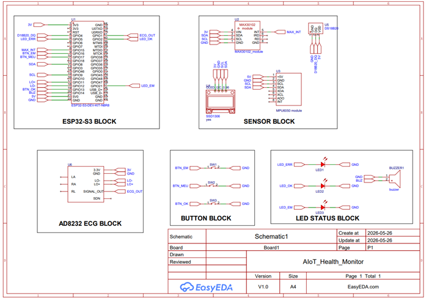

# AIoT Health Monitor

Dự án AIoT học tập dùng ESP32-S3 để theo dõi một số chỉ số sức khỏe theo thời gian thực. Thiết bị đọc cảm biến, gửi dữ liệu qua MQTT over TLS đến Python server, lưu Firebase và hiển thị trên Streamlit dashboard.

> Lưu ý: dự án này phục vụ học tập và demo kỹ thuật. Đây không phải thiết bị y tế và không dùng để chẩn đoán hoặc điều trị.

## 1. Giới thiệu ngắn

Luồng hoạt động:

```text
ESP32-S3 -> WiFi/MQTT TLS -> Flask Server -> AI/Firebase -> Streamlit Dashboard
```

Các phần chính:

| Phần | Công nghệ | File chính |
|---|---|---|
| Firmware | ESP32-S3, Arduino framework, PlatformIO | `esp32_firmware/src/main.cpp` |
| MQTT | HiveMQ Cloud, TLS port `8883` | `server/mqtt_handler.py` |
| Backend | Python 3.11, Flask, Firebase Admin | `server/app.py` |
| AI | scikit-learn, TensorFlow/Keras | `server/ai_engine.py` |
| Dashboard | Streamlit, Plotly | `dashboard/streamlit_app.py` |

## 2. Danh sách linh kiện

| Linh kiện | Mục đích | Nguồn cấp | Ghi chú |
|---|---|---|---|
| ESP32-S3 DevKitC-1 | Vi điều khiển chính | USB | Board trong `platformio.ini` là `esp32-s3-devkitc-1` |
| MAX30102 | Đo SpO2 | ESP32-S3 | Dùng chung bus I2C |
| MPU6050 | Đo gia tốc, phát hiện ngã | ESP32-S3 | Dùng chung bus I2C |
| OLED SSD1306 | Hiển thị trạng thái | ESP32-S3 | I2C, địa chỉ `0x3C` |
| DS18B20 | Đo nhiệt độ | ESP32-S3 | Cần điện trở kéo lên 4.7kΩ |
| AD8232 | Đo tín hiệu ECG | 3.3V theo comment trong `config.h` | OUTPUT dùng GPIO1 |
| Nút nhấn x3 | SOS, Menu, OK | GPIO pull-up nội | Nhấn = `LOW` |
| Buzzer | Cảnh báo âm thanh | ESP32-S3 | GPIO16, dùng `tone()` |
| LED x2 | Báo lỗi và trạng thái OK | ESP32-S3 | GPIO17 và GPIO18 |
| Điện trở 4.7kΩ | Pull-up cho DS18B20 | 3.3V phía pull-up theo `AGENTS.md` | Nối giữa DQ và 3.3V |
| Dây cắm/breadboard | Đấu nối thử nghiệm | - | ESP32-S3 nếu dùng PCB |


## 3. Sơ đồ đấu nối

## Bus I2C dùng chung

Các thiết bị MAX30102, MPU6050 và OLED SSD1306 cùng sử dụng chung một bus I2C của ESP32-S3.

| Thiết bị | Chân module | Chân ESP32-S3 | Nguồn cấp | Ghi chú |
|---|---|---:|---|---|
| MAX30102 | SDA | GPIO8 | 3.3V | I2C, dùng chung bus |
| MAX30102 | SCL | GPIO9 | 3.3V | I2C, dùng chung bus |
| MPU6050 | SDA | GPIO8 | 3.3V | I2C, dùng chung bus |
| MPU6050 | SCL | GPIO9 | 3.3V | I2C, dùng chung bus |
| OLED SSD1306 | SDA | GPIO8 | 3.3V | I2C, dùng chung bus |
| OLED SSD1306 | SCL | GPIO9 | 3.3V | I2C, dùng chung bus |


## Cảm biến và thiết bị ngoại vi

| Thiết bị | Chân module | ESP32-S3 | Nguồn / cấu hình | Ghi chú |
|---|---|---:|---|---|
| DS18B20 | DQ | GPIO4 | 3.3V | Điện trở kéo lên 4.7kΩ giữa DQ và 3.3V |
| AD8232 | OUTPUT | GPIO1 | AD8232: 3.3V | Tín hiệu ECG analog, ADC1_CH0 |
| AD8232 | LO+ | GPIO11 | AD8232: 3.3V | HIGH khi phát hiện điện cực bị rời |
| AD8232 | LO- | GPIO12 | AD8232: 3.3V | HIGH khi phát hiện điện cực bị rời |
| Nút SOS | Signal | GPIO5 | Pull-up nội | Nhấn = LOW |
| Nút Menu | Signal | GPIO6 | Pull-up nội | Nhấn = LOW; chưa xử lý trong main.cpp |
| Nút OK | Signal | GPIO7 | Pull-up nội | Nhấn = LOW |
| Buzzer | Signal | GPIO16 | 3.3V* | Điều khiển bằng tone(); tải lớn cần transistor/MOSFET |
| LED_ERR | Signal | GPIO17 | 3.3V* | LED báo lỗi/cảnh báo, cần điện trở hạn dòng |
| LED_OK | Signal | GPIO18 | 3.3V* | LED báo trạng thái OK, cần điện trở hạn dòng |

> **Lưu ý:** Các mức nguồn của buzzer và LED phụ thuộc loại module/linh kiện thực tế. GPIO ESP32-S3 chỉ dùng để điều khiển tín hiệu, không nên cấp trực tiếp cho tải có dòng lớn.
Thông số liên quan trong firmware:

| Mục | Giá trị trong code |
|---|---|
| Serial baud | `115200` |
| I2C clock | `400000` Hz |
| OLED size | `128x64` |
| OLED I2C address | `0x3C` |
| MQTT TLS port | `8883` |
| MQTT publish interval | `5000` ms |

Mẹo quét I2C:

1. Tạo file test I2C scanner nếu cần.
2. Dùng đúng SDA GPIO8 và SCL GPIO9.
3. Kiểm tra OLED ở địa chỉ `0x3C`.
4. Kiểm tra MPU6050 thường xuất hiện ở `0x68`.
5. Địa chỉ MAX30102 cần quét thực tế.


## 4. Cài đặt môi trường và thư viện

### Firmware

Yêu cầu:

| Công cụ 
|---|
| Visual Studio Code 
| PlatformIO 
| Framework | Arduino qua PlatformIO |
| Board | `esp32-s3-devkitc-1` |

Thư viện firmware trong `esp32_firmware/platformio.ini`:

```ini
lib_deps =
    sparkfun/SparkFun MAX3010x Pulse and Proximity Sensor Library@^1.1.2
    milesburton/DallasTemperature@^4.0.4
    paulstoffregen/OneWire@^2.3.8
    electroniccats/MPU6050@^1.4.3
    adafruit/Adafruit SSD1306@^2.5.15
    adafruit/Adafruit GFX Library@^1.12.1
    knolleary/PubSubClient@^2.8
    bblanchon/ArduinoJson@^7.1.0
```

Cấu hình ESP32-S3 trong `platformio.ini`:

```ini
board = esp32-s3-devkitc-1
monitor_speed = 115200
upload_speed = 460800
```

Firmware không ép USB CDC on boot. Comment trong `platformio.ini` ghi ưu tiên upload/monitor qua USB-to-UART bridge như CH343 trên board thực tế.

### Python server và dashboard

Yêu cầu:

| Công cụ | Phiên bản |
|---|---|
| Python | `3.11` |


Tạo virtual environment trên Windows:

```powershell
python -m venv .venv
```

Kích hoạt virtual environment trên Windows:

```powershell
.\.venv\Scripts\Activate.ps1
```

Tạo virtual environment trên Linux/macOS:

```bash
python3 -m venv .venv
```

Kích hoạt virtual environment trên Linux/macOS:

```bash
source .venv/bin/activate
```

Cài thư viện Python:

```bash
pip install -r server/requirements.txt
```

Các package chính trong `server/requirements.txt`:

| Package | Version |
|---|---:|
| flask | `3.0.0` |
| flask-cors | `4.0.0` |
| paho-mqtt | `2.0.0` |
| firebase-admin | `6.4.0` |
| scikit-learn | `1.4.0` |
| tensorflow | `2.15.0` |
| pandas | `2.1.0` |
| numpy | `1.26.0` |
| joblib | `1.3.0` |
| streamlit | `1.31.0` |
| streamlit-autorefresh | `1.0.1` |
| plotly | `5.18.0` |
| python-telegram-bot | `20.7` |
| python-dotenv | `1.0.0` |
| requests | `2.31.0` |
| apscheduler | `3.10.4` |

### Cấu hình `.env` và `secrets.h`

Server đọc `.env` từ thư mục gốc dự án, kể cả khi chạy lệnh trong thư mục `server/`.

Firmware đọc WiFi/MQTT credentials từ:

```text
esp32_firmware/include/secrets.h
```

MQTT broker, username và password trong `.env` và `secrets.h` phải khớp nhau.

Nội dung mẫu cho `.env.example`:

```env
MQTT_BROKER=xxxx.s1.eu.hivemq.cloud
MQTT_PORT=8883
MQTT_USERNAME=your_mqtt_username
MQTT_PASSWORD=your_mqtt_password
MQTT_CLIENT_ID=aiot_server

FLASK_PORT=5000
FLASK_DEBUG=false

FIREBASE_DATABASE_URL=https://your-project-default-rtdb.firebaseio.com
FIREBASE_KEY_PATH=server/firebase_key.json

AIOT_API_BASE=http://localhost:5000/api
```

Nội dung mẫu cho `esp32_firmware/include/secrets.h.example`:

```cpp
#pragma once

#define WIFI_SSID "your_wifi_name"
#define WIFI_PASSWORD "your_wifi_password"
#define MQTT_USER "your_mqtt_username"
#define MQTT_PASS "your_mqtt_password"
```

Không commit các file thật sau:

```text
.env
esp32_firmware/include/secrets.h
server/firebase_key.json
```

Firmware dùng MQTT TLS với:

```cpp
wifiClient.setInsecure();
```

Điều này nghĩa là firmware dùng TLS nhưng không xác thực CA certificate trong chế độ dev.

## 5. Cách nạp code

1. Mở terminal tại thư mục gốc dự án.

```bash
cd aiot_health
```

2. Tạo file cấu hình server.

```bash
cp .env.example .env
```

3. Điền MQTT và Firebase credentials vào `.env`.

```text
.env
```

4. Tạo file cấu hình firmware.

```bash
cp esp32_firmware/include/secrets.h.example esp32_firmware/include/secrets.h
```

5. Điền WiFi và MQTT credentials vào `secrets.h`.

```text
esp32_firmware/include/secrets.h
```

6. Cắm ESP32-S3 vào máy tính.

7. Chuyển vào thư mục firmware.

```bash
cd esp32_firmware
```

8. Build firmware.

```bash
pio run
```

9. Upload firmware.

```bash
pio run --target upload
```

10. Mở Serial Monitor.

```bash
pio device monitor --filter colorize
```

11. Quay lại thư mục gốc dự án.

```bash
cd ..
```

12. Kích hoạt virtual environment.

```powershell
.\.venv\Scripts\Activate.ps1
```

13. Chạy server Flask.

```bash
cd server
python app.py
```

14. Mở terminal mới tại thư mục gốc dự án.

```bash
cd aiot_health
```

15. Kích hoạt virtual environment.

```powershell
.\.venv\Scripts\Activate.ps1
```

16. Chạy dashboard.

```bash
streamlit run dashboard/streamlit_app.py
```

Server Flask mặc định chạy ở:

```text
http://localhost:5000
```

Dashboard mặc định gọi API:

```text
http://localhost:5000/api
```

## 6. Kết quả mong đợi

Sau khi firmware chạy:

- Serial Monitor dùng baudrate `115200`.
- ESP32-S3 kết nối WiFi.
- ESP32-S3 kết nối MQTT broker qua port `8883`.
- OLED hiển thị trạng thái thiết bị.
- Thiết bị publish dữ liệu lên topic `health/patient_001/data`.

Các topic MQTT trong firmware:

| Mục đích | Topic |
|---|---|
| Data publish | `health/patient_001/data` |
| Alert | `health/patient_001/alert` |
| Medicine | `health/patient_001/medicine` |
| Command | `health/patient_001/cmd` |
| Status | `health/patient_001/status` |

Server subscribe:

| Mục đích | Topic |
|---|---|
| Data | `health/+/data` |
| Medicine | `health/+/medicine` |

Payload firmware gửi trong `main.cpp` gồm các field chính:

```json
{
  "device_id": "patient_001",
  "ts": 1705300000,
  "heart_rate": 75,
  "heart_rate_source": "ad8232",
  "heart_rate_valid": true,
  "spo2": 98,
  "spo2_source": "max30102",
  "spo2_valid": true,
  "temperature": 36.8,
  "ecg_raw": 2048,
  "ecg_mv": 1650,
  "ecg_lead_off": false,
  "ecg_window_mean": 2048,
  "ecg_window_std": 120,
  "ecg_beats": 5,
  "accel_x": 0.01,
  "accel_y": -0.02,
  "accel_z": 0.98,
  "fall": false,
  "edge_alert": false,
  "alert_reason": "",
  "status": "Normal",
  "medicine_active": false,
  "medicine_label": "Thuoc"
}
```

Dashboard hiển thị:

- Nhịp tim.
- SpO2.
- Nhiệt độ.
- Trạng thái ngã.
- AI score.
- Lịch sử cảnh báo.
- ECG nếu có đủ dữ liệu mẫu.

### Chạy thử không cần phần cứng

1. Chạy server Flask.

```bash
cd server
python app.py
```

2. Mở terminal mới tại thư mục gốc.

```bash
cd aiot_health
```

3. Gửi dữ liệu demo qua API local.

```bash
python demo_send_data.py --transport api --mode normal
```

4. Gửi dữ liệu demo cảnh báo nhịp tim cao.

```bash
python demo_send_data.py --transport api --mode high_hr
```

5. Gửi dữ liệu demo ngã.

```bash
python demo_send_data.py --transport api --mode fall
```

6. Mở dashboard.

```bash
streamlit run dashboard/streamlit_app.py
```

Các mode demo có trong code:

```text
normal, stress, high_hr, low_spo2, fall, ecg, ecg_anomaly, ecg_lead_off
```

## 7. Troubleshooting

### ESP32-S3 và PlatformIO

| Lỗi | Nguyên nhân có thể | Cách xử lý |
|---|---|---|
| Không thấy Serial log | Sai baudrate | Đặt monitor ở `115200` |
| Không upload được | Chọn sai port hoặc board chưa vào chế độ upload | Kiểm tra port trong PlatformIO |
| Serial không hiện qua USB CDC | Project không ép USB CDC on boot | Dùng cổng USB-to-UART bridge nếu board có |
| Build lỗi trùng `setup()` / `loop()` | Build nhầm file test sensor | Dùng env mặc định `esp32s3_n16r8` |
| Không đọc được OLED/MAX30102/MPU6050 | Sai SDA/SCL hoặc lỗi bus I2C | Kiểm tra GPIO8/GPIO9 và chạy I2C scanner |

### MQTT TLS

| Lỗi | Nguyên nhân có thể | Cách xử lý |
|---|---|---|
| MQTT không kết nối | Broker/user/password sai | Kiểm tra `.env` và `secrets.h` |
| Server MQTT không chạy | Thiếu `MQTT_BROKER`, `MQTT_USERNAME`, `MQTT_PASSWORD` | Kiểm tra `.env` |
| Firmware TLS lỗi cert | Firmware đang dùng `setInsecure()` cho dev | Không cần CA cert trong cấu hình hiện tại |
| Server TLS lỗi | Python dùng `client.tls_set(tls_version=ssl.PROTOCOL_TLS_CLIENT)` | Kiểm tra broker cloud và port `8883` |

### Cảm biến và dashboard

| Lỗi | Nguyên nhân có thể | Cách xử lý |
|---|---|---|
| DS18B20 không đọc nhiệt độ | Thiếu pull-up | Nối điện trở 4.7kΩ giữa DQ và 3.3V |
| MAX30102 không có SpO2 | Chưa đặt tay hoặc tín hiệu yếu | Đặt ngón tay ổn định trên cảm biến |
| ECG báo điện cực rời | LO+ hoặc LO- đang HIGH | Kiểm tra điện cực AD8232 |
| Không có dữ liệu Firebase | Thiếu Firebase URL hoặc key | Kiểm tra `.env` và `server/firebase_key.json` |
| Dashboard không tải dữ liệu | Flask server chưa chạy | Chạy `cd server` rồi `python app.py` |
| Dashboard gọi sai API | `AIOT_API_BASE` hoặc ô API Base URL sai | Dùng `http://localhost:5000/api` |

## 8. Cấu trúc thư mục

```text
aiot_health/
├── AGENTS.md
├── README.md
├── DEMO_GUIDE.md
├── LEARNING_MAP.md
├── demo_send_data.py
├── .env.example
├── esp32_firmware/
│   ├── platformio.ini
│   ├── src/
│   │   ├── main.cpp
│   │   ├── test_ad8232.cpp
│   │   ├── test_ds18b20.cpp
│   │   ├── test_max30102.cpp
│   │   └── test_mpu6050.cpp
│   └── include/
│       ├── config.h
│       ├── button_handler.h
│       ├── menu_system.h
│       ├── medicine.h
│       └── secrets.h.example
├── server/
│   ├── app.py
│   ├── mqtt_handler.py
│   ├── firebase_handler.py
│   ├── ai_engine.py
│   ├── alert_bot.py
│   ├── medicine_manager.py
│   └── requirements.txt
├── dashboard/
│   ├── streamlit_app.py
│   ├── api_client.py
│   ├── formatters.py
│   ├── styles.py
│   └── components/
├── ai_training/
│   ├── prepare_dataset.py
│   ├── train_health_classifier.py
│   ├── train_isolation_loso.py
│   ├── retrain_after_hardware_change.py
│   ├── generate_synthetic_raw_data.py
│   ├── export_colab_notebook_data.py
│   └── notebooks/
├── data/
│   ├── collect_labeled.py
│   ├── raw/
│   └── processed/
├── models/
└── agents/
    └── skills/
```

Các file không nên commit:

```text
.env
esp32_firmware/include/secrets.h
server/firebase_key.json
.venv/
esp32_firmware/.pio/
models/
data/raw/
```
